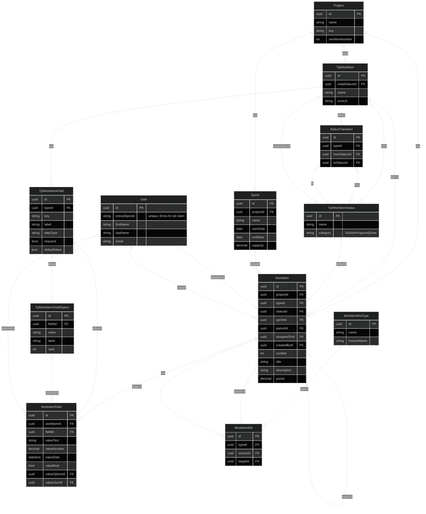

# Loom — Data Model

Entity-relationship diagram of the core backend model, companion to
[high-level-design.md](high-level-design.md). Only `Project` is implemented
today; everything else here is design.

Design choices worth calling out before the diagram:

- **Work item types are shared definitions, used by reference.** The `Tpl*`
  tables (`TplWorkItem`, `TplWorkItemField`, `TplWorkItemFieldOption`,
  `TplWorkItemStatus`) define the schema once, at the app level. A project
  opts into the types it uses; nothing is copied. Editing a type changes it
  for every project that uses it, and a project cannot customize a type on
  its own.
- **Statuses are shared; workflows are per type.** A status (e.g. "In
  Progress") is one row used by any number of types. What differs per type
  is which transitions are allowed between them (`StatusTransition.typeId`)
  and where new items start (`TplWorkItem.initialStatusId`).
- **Custom field values are typed rows.** Each value is a `WorkItemField` row
  with one typed value column set, so values can be indexed, filtered, and
  checked with real foreign keys.
- **Parent/child is a column; every other link is an edge row.**
  `WorkItem.parentId` models the hierarchy. `WorkItemRel` holds peer links
  ("blocks", "relates to") typed by `WorkItemRelType`. Relationship types are
  global, so links between items in different projects need no extra
  structure.

## Conventions

- **Logical model.** Column names are shown in camelCase with generic types;
  the physical schema follows the C# entities (PascalCase, `Guid`, EF
  mappings). Avoid the reserved word `User` as a table name (e.g. use
  `Users` or `AppUsers`).
- **Foreign keys are named `<role>Id`**, where the role is short when the
  table has one reference to the target (`typeId`, `statusId`, `fieldId`)
  and explicit when it has several (`fromStatusId` / `toStatusId`,
  `assignedToId` / `createdById`).
- **Many-to-many link tables are not drawn.** `Project ↔ TplWorkItem` and
  `TplWorkItem ↔ TplWorkItemStatus` each get a plain link table with the two
  foreign keys and nothing else.
- **Every table** also carries the base columns from `DbEntity`: `Id`,
  `CreatedAt`, `UpdatedAt`, and `DeletedAt` (soft delete). They are omitted
  from the diagram.
- **Nullable columns** (the diagram cannot show them):
  - `WorkItem.sprintId` — null means the item is in the backlog.
  - `WorkItem.parentId` — null means a top-level item.
  - `WorkItem.assignedToId` — null means unassigned.
  - `WorkItem.points` — null means not estimated, which is different from 0.
  - `WorkItemField` value columns — exactly one is set (see Invariants).
  - `WorkItemRelType.inverseName` — null means the type is symmetric.
  - `TplWorkItemField.defaultValue` — null means no default.
- **Soft delete and uniqueness.** Deleted rows stay in the table, so every
  unique index below must be filtered (`WHERE DeletedAt IS NULL`), or a
  deleted row will block re-creating something with the same name.

## Invariants

Enforced with unique indexes or check constraints where the database can
express them, otherwise in the service layer.

- `Project`:
  - `key` is unique and never changes after creation (it is the prefix of
    every item key, so changing it would break existing references).
  - `nextItemNumber` is read and incremented in the same transaction that
    inserts the work item. `MAX(number) + 1` is not safe under concurrent
    inserts.
- `TplWorkItem`:
  - `name` is unique.
  - `initialStatusId` is one of the statuses the type uses.
- `TplWorkItemStatus`: `name` is unique.
- `TplWorkItemField`:
  - `(typeId, key)` is unique, and `key` never changes after creation.
    Renaming a field only changes `label`.
  - `dataType` is one of a fixed set, initially
    `Text | Number | Date | Bool | Option | MultiOption | User`.
- `TplWorkItemFieldOption`: `(fieldId, value)` is unique. Only fields with
  an `Option` or `MultiOption` data type have options.
- `StatusTransition`:
  - `(typeId, fromStatusId, toStatusId)` is unique, and
    `fromStatusId <> toStatusId`.
  - Both statuses are ones the type uses.
- `WorkItem`:
  - `(projectId, number)` is unique.
  - The item's type is one of the project's types.
  - The item's status is one of its type's statuses. A new item starts in the
    type's `initialStatusId`, and a status change must follow one of the
    type's `StatusTransition` rows.
  - `sprintId`, when set, is a sprint of the item's project.
  - `parentId` is never the item itself, and the parent chain has no cycles
    (the service walks up the new parent's ancestors before saving).
- `WorkItemField`:
  - Exactly one value column is set, and it matches the field's `dataType`.
    A check constraint can enforce "exactly one"; matching the data type is
    service-enforced because the constraint cannot see the field definition.
  - `fieldId` belongs to the item's type.
  - `valueOptionId`, when set, is an option of `fieldId`.
  - `(workItemId, fieldId)` is unique, except for `MultiOption` fields, which
    store one row per selected option with `(workItemId, fieldId,
    valueOptionId)` unique.
  - Every `required` field of the type has a value.
- `WorkItemRel`:
  - `(typeId, sourceId, targetId)` is unique and `sourceId <> targetId`.
  - A symmetric type (null `inverseName`) stores one canonical row, lower id
    as source, so `A relates-to B` and `B relates-to A` cannot both exist.
- `WorkItemRelType`: `name` is unique.

## Notes

- **Why types are used by reference.** Copying types into each project on
  adoption would need lineage back to the source, a versioning story for
  template edits, and rules for which project's copy a cross-project link
  uses. Sharing one definition removes all of that. The cost is that a
  project cannot customize a type, which is acceptable for a single-tenant
  tool.
- **`TplWorkItemStatus.category`** is the one part of a status the
  application understands; the name is user data. Boards, burndown, sprint
  close (which items carry over), "open items" queries, and resolving
  "blocked by" links all depend on it. `ToDo` / `InProgress` / `Done` (rather
  than a single `isDone` flag) also tells whether work has started, which
  gives cycle time and work-in-progress counts.
- **Board column order is not part of the model.** Users arrange their own
  boards. The default order, and the order used by API/MCP responses, is by
  `category`, then by name.
- **Custom field indexes.** Filtering on custom fields goes through indexes
  on `(fieldId, valueOptionId)`, `(fieldId, valueNumber)`,
  `(fieldId, valueDate)`, and `(fieldId, valueUserId)`.
  `TplWorkItemField.defaultValue` stays JSON because it is configuration and
  is never filtered on.
- **`TplWorkItemFieldOption.rank`** is a meaningful order, not a display
  preference: sorting by priority needs Low < Medium < High, and so do
  filters like "priority ≥ Medium". Sorting by `label` or by creation order
  gets this wrong.
- **Why the parent is a column.** The hierarchy is special-cased anyway
  (trees, roll-ups, cycle checks, grouping boards by epic). A single
  `parentId` column lets the database enforce "at most one parent", keeps
  subtree queries to a recursive CTE, and avoids a predefined "parent of" row
  in the user-editable `WorkItemRelType` table. Every remaining link type is
  many-to-many, so `WorkItemRelType` has no cardinality column.
- **`WorkItemRelType.inverseName`** is the label seen from the target side
  ("blocks" / "is blocked by").
- **Readable item keys** are `{Project.key}-{WorkItem.number}`, e.g.
  `LOOM-123`.
- **Sprints.** A work item holds its current sprint in `sprintId`; carrying
  an item over to the next sprint updates that column. Past sprint
  membership, and when items reached `Done`, come from the planned history
  tables (see Open questions), which is what burndown and past-sprint
  reports are built from. `Sprint.capacity` is in points and is set per
  sprint, because availability changes from sprint to sprint.
- **`WorkItem` is incomplete by design.** More built-in fields will be added
  as they are implemented.

## Open questions

1. **Work item history (planned).** An append-only record of who changed
   what, added once the core model is in place. It also provides status
   history and past sprint membership for burndown. Proposed shape: a
   `WorkItemRevision` per save (`workItemId`, `changedById`, `changedAt`)
   with one `WorkItemRevisionChange` per changed property (`property`,
   `fieldId` for custom fields, `oldValue`, `newValue`). To decide:
   - Grouped per save (two tables) or one flat change table.
   - Store referenced ids only (names resolved on read, so renames rewrite
     old history) or also snapshot the names.

   Whatever the shape, creation is logged as the first revision, and the
   service writes the item and its revision in one transaction.
2. **Parent rules.** Can an item's parent be in another project? Is the
   hierarchy restricted by type (Epic → Story → Task), e.g. via an allowed
   parent type on `TplWorkItem`?
3. **Removing a type from a project** while live items still use it: block
   it, or allow it and leave the items as they are?
4. **Sprint state and overlap.** Is a sprint's state (planned / active /
   closed) derived from its dates or stored explicitly? Can two sprints in
   the same project overlap?
5. **Relationship pair rules.** Should a relationship type be restricted to
   certain pairs of work item types (e.g. only a Bug can block a Story)?
   Not modeled yet; any pair is allowed.
6. **Saved queries.** Deferred until querying is designed. Custom field
   filters will run against the typed `WorkItemField` columns.
7. **Board layouts.** Per-user column order can live in the front end at
   first. If a layout needs to follow a user across devices or be shared,
   it needs a board/view entity owned by a user and a project.
8. **Transition guards.** The design doc mentions rules on transitions (e.g.
   "assignee must be set"). Not modeled until automation rules are designed.
9. **Permissions.** The design doc says the permission model should exist
   before more people are added, but the model has no project membership or
   role table. Not needed for single-user, but decide before auth lands.
10. **Comments.** A transition guard like "requires a comment" implies a
    `Comment` entity that does not exist yet.
