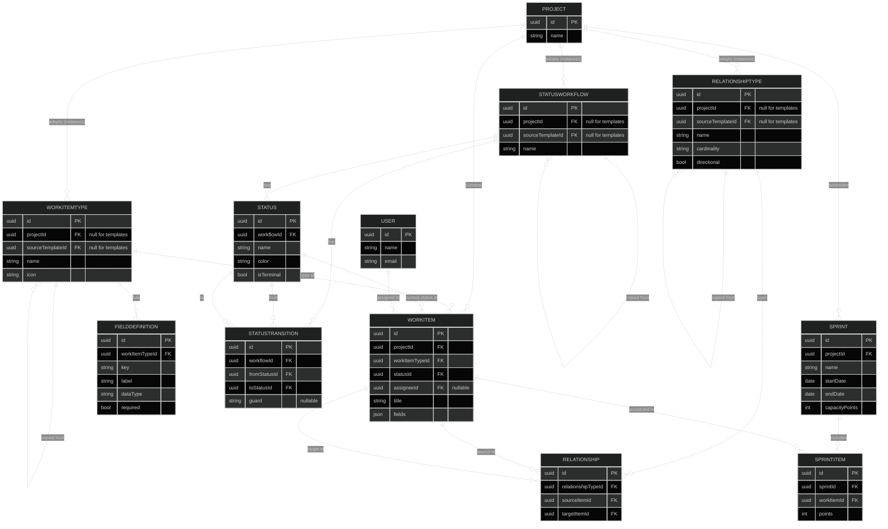

# Loom — Data Model

Entity-relationship diagram of the core backend model. Two design choices
worth calling out before the diagram:

- **Templates and project-level instances share the same tables.**
  `WorkItemType`, `StatusWorkflow`, and `RelationshipType` each have a
  nullable `projectId`,
  set means "this is what a project actually uses." A project's copy
  points back at its template via `sourceTemplateId` (copy-on-use with
  lineage), instead of needing a separate template/instance schema.
- **Relationships between work items are just edge rows.** `Relationship`
  has a `sourceItemId` and `targetItemId`, both pointing at `WorkItem`,
  typed by `RelationshipType` — this is what makes cross-project links
  possible for free (the two items just need to live in different
  projects; nothing else changes).

## Notes

- `WorkItem.fields` is a JSON blob validated at write-time against its
  type's `FieldDefinition` rows — this is what lets custom fields exist
  without a schema migration every time someone adds one.
- `Status.isTerminal` marks states a workflow doesn't expect to transition
  out of (e.g. "Done"), used to drive board styling and burndown logic.
- `StatusTransition.guard` is a placeholder for the rule engine (e.g.
  "assignee must be set") — worth a proper guard/condition model once
  automation rules are designed.
