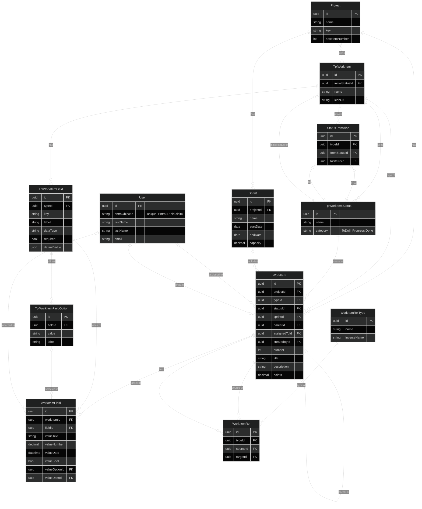

# Loom — Data Model

Entity-relationship diagram of the core backend model, companion to
[high-level-design.md](high-level-design.md). Only `Project` is implemented
today; everything else here is design.

Two design choices worth calling out before the diagram:

- **Templates and project-level instances share the same tables.**
  `WorkItemType`, `StatusWorkflow`, and `RelationshipType` each have a
  nullable `projectId`: null means "app-level template", set means "this is
  what a project actually uses." A project's copy points back at its
  template via `sourceTemplateId` (copy-on-use with lineage), instead of
  needing a separate template/instance schema. Child rows (`FieldDefinition`,
  `Status`, `StatusTransition`) are copied along with their parent, and
  references between the copied rows are remapped to the copies.
- **Relationships between work items are just edge rows.** `Relationship`
  has a `sourceItemId` and `targetItemId`, both pointing at `WorkItem`,
  typed by `RelationshipType` — this is what makes cross-project links
  possible without extra structure (the two items just need to live in
  different projects). See open question 1: how the *type* of a
  cross-project edge is resolved is not settled yet.

## Conventions

- **Logical model.** Column names are shown in camelCase with generic types;
  the physical schema follows the C# entities (PascalCase, `Guid`, EF
  mappings). Avoid the reserved word `User` as a table name (e.g. use
  `Users` or `AppUsers`).
- **Every table** also carries the base columns from `DbEntity`: `Id`,
  `CreatedAt`, `UpdatedAt`, and `DeletedAt` (soft delete). They are omitted
  from the diagram.
- **Soft delete and uniqueness.** Deleted rows stay in the table, so every
  unique index below must be filtered (`WHERE DeletedAt IS NULL`), or a
  deleted row will block re-creating something with the same name.

## Invariants

Enforced with unique indexes or check constraints where the database can
express them, otherwise in the service layer.

- Templates are not copies: `projectId` is null ⇒ `sourceTemplateId` is null.
- Names are unique per scope: `(projectId, name)` on `WorkItemType`,
  `StatusWorkflow`, and `RelationshipType`. A null `projectId` is its own
  scope, so template names are unique among templates.
- `FieldDefinition`: `(workItemTypeId, key)` is unique, and `key` never
  changes after creation (it is the property name inside `WorkItem.fields`).
- `Status`: exactly one `isInitial` status per workflow. New work items start
  there, and every `WorkItemStatusChange` chain begins with a null
  `fromStatusId`.
- `StatusTransition`: `(workflowId, fromStatusId, toStatusId)` is unique, and
  both statuses belong to `workflowId`.
- `WorkItem` *(service-enforced, no FK can express these)*:
  - `statusId` belongs to the workflow of the item's type.
  - The item's type belongs to the item's project.
- `Relationship`: `(relationshipTypeId, sourceItemId, targetItemId)` is
  unique and `sourceItemId <> targetItemId`. A symmetric type stores one
  canonical edge (lower id as source) so `A relates-to B` and
  `B relates-to A` cannot both exist.
- `RelationshipTypeRule`: no rows for a type means any pair of work item
  types is allowed.
- `SprintItem`: `(sprintId, workItemId)` is unique.

## Notes

- `WorkItem.fields` is a JSON blob validated at write-time against its
  type's `FieldDefinition` rows — this is what lets custom fields exist
  without a schema migration every time someone adds one. Because `key` is
  immutable, renaming a field only changes `label`. Deleting a definition
  leaves orphaned keys in existing blobs, which reads should ignore.
- `Status.isInitial` says where a new item starts; `Status.isTerminal` marks
  states a workflow doesn't expect to transition out of (e.g. "Done"), used
  to drive board styling and burndown logic; `sortOrder` gives the board its
  column order.
- `WorkItemStatusChange` is an append-only log written on every transition.
  Burndown "derived from status + points over the sprint window" is not
  possible from current status alone, so this table is what makes it
  possible. It also gives per-item history for free.
- `RelationshipType.inverseName` is the label seen from the target side
  ("blocks" / "is blocked by"). Symmetric types (`directional = false`, e.g.
  "relates to") have none.
- `RelationshipTypeRule` implements the "which type pairs are allowed to use
  it" rule from the design doc.
- `StatusTransition.guard` is a placeholder for the rule engine (e.g.
  "assignee must be set") — worth a proper guard/condition model once
  automation rules are designed.
- `SavedQuery.filter` is a structured filter over the predefined fields
  (assignee, status, project, priority, ...). It is stored as JSON so the
  filter shape can evolve without migrations.

## Open questions

1. **Which relationship type does a cross-project edge use?** Relationship
   types are copied per project, so project A's "blocks" and project B's
   "blocks" are different rows with potentially different cardinality and
   pair rules. An edge from A to B has to pick one. The same problem applies
   to `RelationshipTypeRule`, which points at per-project work item types.
   Options:
   - **(a)** Relationship types are app-level only and never copied; rules
     reference work item type templates and are matched through
     `sourceTemplateId`. Simple, and cross-project edges are unambiguous,
     but a project cannot customize a relationship type, and project-only
     item types (no template) cannot take part in typed rules.
   - **(b)** Keep the copies; the edge's type must belong to the *source*
     item's project, and the target side is validated by template lineage.
     Keeps per-project customization, but adds real rules to explain.

   Leaning towards (a): relationship types are the one template kind whose
   whole purpose is to span projects.
2. **Template versioning.** The design doc says lineage back to "the source
   template/version", but `sourceTemplateId` points at a mutable row. Either
   add `sourceTemplateVersion` (and version templates on edit), or drop
   "version" from the design doc and accept that lineage means "copied from
   this template, whatever it looked like then".
3. **`SprintItem.points`.** Is it a snapshot of the estimate at commit time
   (carry-over between sprints keeps its own value), or should the estimate
   live on the work item, so `points` here is redundant? Mid-sprint scope
   changes also need `addedAt`/`removedAt` if burndown must show scope
   creep; soft delete's `DeletedAt` can serve as `removedAt`.
4. **Permissions.** The design doc says the permission model should exist
   before more people are added, but the model has no project membership or
   role table. Not needed for single-user, but decide before auth lands.
5. **Comments.** The transition guard example "requires a comment" implies a
   `Comment` entity that does not exist yet.
6. **Querying `fields`.** Saved queries filtering on `priority` or other
   custom fields hit the JSON blob, which is not indexable in the general
   case. Decide whether fields that queries and boards depend on (priority,
   points) are promoted to real columns on `WorkItem`, or whether JSON
   indexes / computed columns are acceptable.
